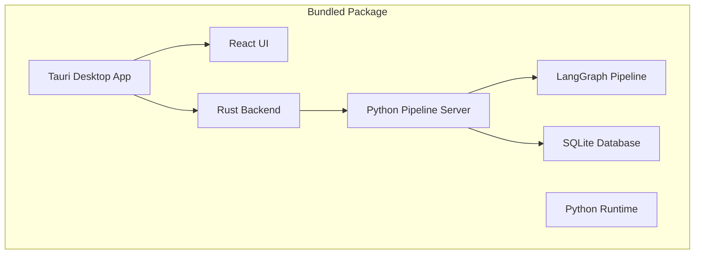

# 🚀 GeneKnow Deployment Guide

This guide explains how to build, package, and distribute the GeneKnow desktop application with its integrated Python pipeline server.

## 📋 Table of Contents

1. [Architecture Overview](#architecture-overview)
2. [Development Setup](#development-setup)
3. [Building for Production](#building-for-production)
4. [Platform-Specific Builds](#platform-specific-builds)
5. [Distribution](#distribution)
6. [First-Run Experience](#first-run-experience)
7. [Troubleshooting](#troubleshooting)

## 🏗️ Architecture Overview

GeneKnow consists of two main components that are bundled together:



### Components:

1. **Tauri Desktop Application**
   - React/TypeScript frontend
   - Rust backend for system integration
   - Manages Python server lifecycle

2. **GeneKnow Pipeline Server**
   - Flask + SocketIO server
   - LangGraph genomic processing pipeline
   - SQLite database for population variants
   - Runs locally on port 5001

## 🔧 Development Setup

### Prerequisites

- Node.js 20+ with pnpm
- Rust 1.77+
- Python 3.11+
- Git

### Local Development

```bash
# Clone the repository
git clone https://github.com/astrogirlnim/GeneKnow.git
cd GeneKnow

# Install frontend dependencies
cd desktop/ui
pnpm install

# Set up Python environment (optional for development)
cd ../../geneknow_pipeline
python -m venv venv
source venv/bin/activate  # Windows: venv\Scripts\activate
pip install -r requirements.txt

# Run in development mode
cd ../desktop/ui
pnpm run tauri-dev
```

## 📦 Building for Production

### 1. Bundle Python Runtime

Before building the Tauri app, bundle the Python runtime and dependencies:

**macOS/Linux:**
```bash
cd desktop
chmod +x scripts/bundle-python.sh
./scripts/bundle-python.sh
```

**Windows:**
```powershell
cd desktop
powershell -ExecutionPolicy Bypass -File scripts\bundle-python.ps1
```

This creates a `desktop/bundled_resources/` directory containing:
- Standalone Python runtime
- All Python dependencies
- Pipeline server code
- Startup scripts

### 2. Build the Tauri Application

```bash
cd desktop/ui
pnpm run tauri-build
```

This will:
1. Build the React frontend
2. Compile the Rust backend
3. Include bundled resources
4. Create platform-specific installers

## 🖥️ Platform-Specific Builds

### macOS

**Output:** `desktop/src-tauri/target/release/bundle/dmg/GeneKnow_x.x.x_<arch>.dmg`

**Requirements:**
- macOS 10.13+
- Code signing certificate (optional but recommended)
- Notarization for distribution outside App Store

**Build Command:**
```bash
pnpm run tauri-build -- --target universal-apple-darwin
```

### Windows

**Output:** `desktop/src-tauri/target/release/bundle/msi/GeneKnow_x.x.x_x64_en-US.msi`

**Requirements:**
- Windows 10/11
- Visual Studio Build Tools
- Code signing certificate (optional but recommended)

**Build Command:**
```bash
pnpm run tauri-build -- --target x86_64-pc-windows-msvc
```

### Linux

**Output:** 
- AppImage: `desktop/src-tauri/target/release/bundle/appimage/gene-know_x.x.x_amd64.AppImage`
- Debian: `desktop/src-tauri/target/release/bundle/deb/gene-know_x.x.x_amd64.deb`

**Requirements:**
- Ubuntu 20.04+ or compatible
- libwebkit2gtk-4.0-dev
- libssl-dev

**Build Command:**
```bash
pnpm run tauri-build
```

## 🌐 Distribution

### GitHub Releases (Automated)

The project uses GitHub Actions for automated releases:

1. Push to `main` branch triggers the release workflow
2. Version is automatically bumped
3. Builds are created for all platforms
4. Release is published with download links

### Manual Distribution

1. **Code Signing** (Recommended)
   - macOS: Sign with Developer ID certificate
   - Windows: Sign with Authenticode certificate
   
2. **Notarization** (macOS)
   ```bash
   xcrun altool --notarize-app \
     --primary-bundle-id "com.geneknow.app" \
     --username "your-apple-id" \
     --password "app-specific-password" \
            --file GeneKnow.dmg
   ```

3. **Upload to Distribution Channels**
   - Company website
   - App stores (if applicable)
   - Enterprise deployment systems

## 🎯 First-Run Experience

When users first launch GeneKnow:

1. **Environment Check**
   - Verifies bundled Python runtime
   - Checks all dependencies

2. **Database Initialization**
   - Creates population variants database if needed
   - Shows progress to user
   - Takes 1-3 minutes on first run

3. **Server Startup**
   - Launches Python pipeline server
   - Waits for health check
   - Establishes communication

4. **Verification**
   - Tests pipeline connectivity
   - Ensures all components work

The UI shows a beautiful setup wizard during this process.

## 🛠️ Troubleshooting

### Build Issues

**Python bundle fails:**
```bash
# Check Python version
python --version  # Should be 3.11.x

# Manually test bundling
cd desktop/bundled_resources
./python_runtime/bin/python3 --version
```

**Tauri build fails:**
```bash
# Clear caches
cd desktop/ui
rm -rf node_modules dist
pnpm install
pnpm run tauri-build
```

### Runtime Issues

**Server won't start:**
1. Check logs in `~/Library/Logs/GenePredict/` (macOS)
2. Verify port 5001 is free
3. Check bundled Python works

**Database initialization fails:**
1. Ensure sufficient disk space (need ~100MB)
2. Check write permissions
3. Try manual initialization

### Platform-Specific Issues

**macOS: "App is damaged"**
- App needs notarization
- Run: `xattr -cr /Applications/GenePredict.app`

**Windows: SmartScreen warning**
- App needs code signing
- Users can click "More info" → "Run anyway"

**Linux: AppImage won't run**
```bash
chmod +x GenePredict.AppImage
./GenePredict.AppImage
```

## 📊 Deployment Checklist

Before releasing:

- [ ] Run full test suite
- [ ] Test on clean systems
- [ ] Verify Python bundling works
- [ ] Check database initialization
- [ ] Test server startup/shutdown
- [ ] Verify file processing works
- [ ] Check error handling
- [ ] Update version numbers
- [ ] Create release notes
- [ ] Code sign binaries
- [ ] Notarize macOS build
- [ ] Test auto-updater (if enabled)

## 🔐 Security Considerations

1. **Local-Only Processing**
   - Server binds to localhost only
   - No external network access
   - All data stays on device

2. **Code Signing**
   - Prevents tampering
   - Builds user trust
   - Required for some platforms

3. **Bundled Dependencies**
   - All deps included
   - No runtime downloads
   - Consistent environment

## 📚 Additional Resources

- [Tauri Documentation](https://tauri.app/v1/guides/)
- [Python Standalone Builds](https://github.com/astral-sh/python-build-standalone)
- [Code Signing Guide](https://tauri.app/v1/guides/distribution/sign)
- [GitHub Actions Release](https://github.com/tauri-apps/tauri-action)

---

*Last Updated: January 2025* 