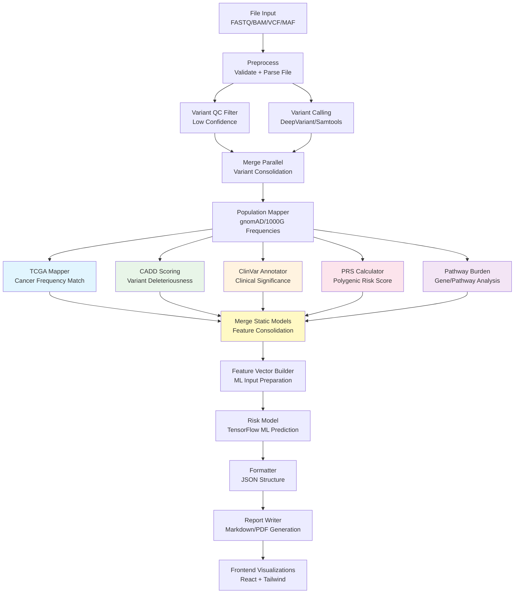
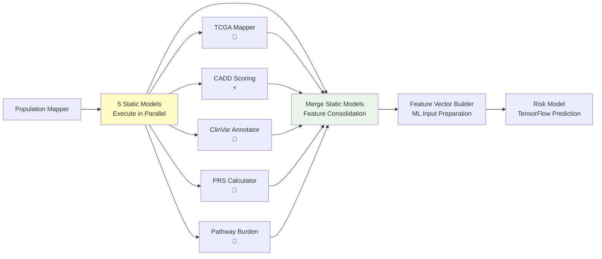

# 🧬 GeneKnow LangGraph Architecture & Code Scaffold (Based on Current Codebase)

## 🎯 Overview

GeneKnow is a local-first genomic risk assessment platform focused on interpreting genomic data through AI-powered cancer prediction models. This document presents an updated LangGraph architecture and file scaffold fully aligned with your current implementation built on Tauri, React, and Rust.

---

## 🧠 LangGraph System Flow



---

## 🏗️ Static Risk Model Architecture

The updated pipeline now features **5 static risk models operating in parallel** after population mapping:

### 🔄 Parallel Static Models

1. **🧬 TCGA Mapper** - Matches variants against cancer tumor frequencies from TCGA cohorts
2. **⚡ CADD Scoring** - Assigns deleteriousness scores to variants (PHRED-scaled)
3. **🏥 ClinVar Annotator** - Provides clinical significance annotations for known variants
4. **🧮 PRS Calculator** - Computes polygenic risk scores from genome-wide association studies
5. **🔬 Pathway Burden** - Analyzes gene/pathway-level variant burden for cancer-related pathways

### 🔗 Integration Flow



### 📊 Output Integration

Each static model contributes specific features to the final risk calculation:

- **TCGA Mapper**: Tumor frequency scores and cancer type associations
- **CADD Scoring**: Variant deleteriousness scores (0-40 PHRED scale)
- **ClinVar Annotator**: Clinical significance scores and pathogenicity flags
- **PRS Calculator**: Polygenic risk scores and percentile rankings
- **Pathway Burden**: Gene set enrichment scores and pathway disruption metrics

---

## 📁 Updated Project Scaffold

```
LiteratureGapper/ (root)
├── desktop/
│   ├── src-tauri/               # Rust backend
│   │   ├── src/
│   │   │   ├── main.rs          # Entry point
│   │   │   ├── lib.rs           # Bridge to Python
│   │   │   └── file_utils.rs    # File validation & memory mgmt
│   │   ├── tauri.conf.json
│   │   └── Cargo.toml
│   └── ui/                      # React + Tailwind frontend
│       ├── src/
│       │   ├── main.tsx
│       │   ├── App.tsx
│       │   ├── hooks/
│       │   │   └── useLogger.ts
│       │   └── components/
│       │       ├── FileUploader.tsx
│       │       ├── RiskVisualizer.tsx
│       │       └── ReportPreview.tsx
│       └── tailwind.config.ts
├── langgraph/                   # New AI processing layer
│   ├── graph.py                 # LangGraph entry
│   ├── nodes/
│   │   ├── file_input.py
│   │   ├── preprocess.py
│   │   ├── variant_calling.py
│   │   ├── qc_filter.py
│   │   ├── tcga_mapper.py
│   │   ├── risk_model.py
│   │   ├── formatter.py
│   │   └── report_writer.py
├── models/                      # ML models
│   ├── breast_cancer_model.h5
│   ├── colon_cancer_model.h5
│   └── blood_cancer_model.h5
├── tcga_data/                   # Local reference datasets
│   ├── brca_data.vcf
│   ├── colon_data.vcf
│   └── marrow_data.vcf
├── docs/
├── documentation/
└── README.md
```

---

## 🛠️ Implementation Details

### 🧬 Variant Calling

- **Tool**: DeepVariant (local execution)
- **Input**: FASTQ/BAM
- **Output**: Annotated VCF

### 🧠 ML Risk Models (TensorFlow)

- Breast cancer: BRCA1, BRCA2, TP53
- Colon cancer: APC, KRAS, SMAD4
- Bone/blood cancer: JAK2, FLT3, DNMT3A

### 🧠 LangGraph Nodes (Python)

- `file_input.py`: Reads and validates file metadata
- `preprocess.py`: Converts FASTQ/BAM to compatible formats
- `variant_calling.py`: Wraps DeepVariant calls
- `qc_filter.py`: Quality control filtering of VCF
- `tcga_mapper.py`: Match variants to TCGA cohorts
- `risk_model.py`: TensorFlow model inference
- `formatter.py`: JSON structuring of results
- `report_writer.py`: Prompts Llama 3.1 to generate markdown/pdf

### 🧾 LLM Report Generation

- **Tool**: Llama 3.1 (Ollama/GGUF local runner)
- **Prompt**: Includes demographics, variants, risk predictions, and TCGA match
- **Output**: Markdown → PDF (multi-language: English, Hindi, Spanish)

---

## 🧱 Architecture Considerations

- **Local-first**: Complies with HIPAA/GDPR.
- **Rust ↔ Python Bridge**: Use Tauri plugin for fast, memory-safe file processing + Python inference.
- **Memory Constraints**: Use streaming reads where possible. Encrypt temp files.
- **Frontend Sync**: JSON outputs feed into React visual components (`RiskVisualizer`, `ReportPreview`).
- **PDF Generation**: Use LLM + Puppeteer or Rust-based renderer (e.g., `printpdf` crate).

---

## 📄 Report Structure Template (Markdown)

```md
# Patient Genomic Risk Report

## Summary
> This report details the genomic risk assessment based on provided genetic data. High-risk findings are highlighted.

## Key Risk Findings
- Breast Cancer Risk: 72.8%
  - BRCA1 (c.5266dupC)
- Colon Cancer Risk: 19.3%
- Blood/Bone Cancer Risk: 4.7%

## Variant Match Summary
| Gene | Variant | TCGA Match | Clinical Note |
|------|---------|------------|----------------|
| BRCA1 | c.5266dupC | 63.2% of BRCA patients | Consider enhanced screening |

## Visualizations
- Heatmap of risk per gene
- Pie chart of TCGA match distribution

## Notes
Generated with Llama 3.1 using local inference.
```

---

## 📌 Development Roadmap Alignment

- ✔️ **Phase 1**: Tauri + React foundation complete
- 🚧 **Phase 2**: Parsing + TensorFlow integration via LangGraph
- 🧪 **Phase 3**: Frontend UI and visualization in progress
- 📄 **Phase 4**: LLM report generation pending

---

Let me know if you want code generation for specific LangGraph nodes or Tauri–Python bindings!

